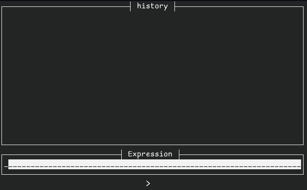

# TUI-QALC

A simple tui app for calculation acting as a wrapper of the [qalc](https://qalculate.github.io/)(**required**) cli program/library
with instant preview and results history



## Usage

You need qalc installed and in your PATH as well as cargo and rust.
```
git clone https://github.com/heisenshark/tui-qalc.git
cd tui-qalc
cargo run
```
